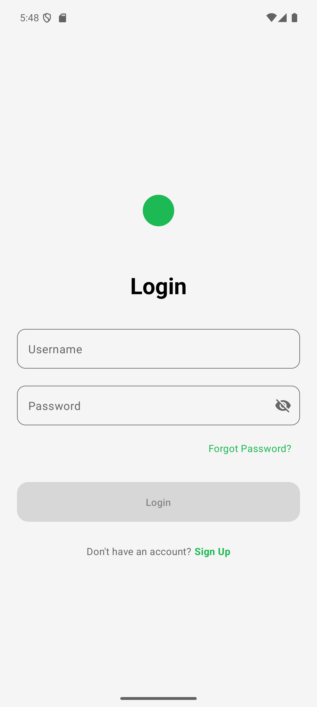
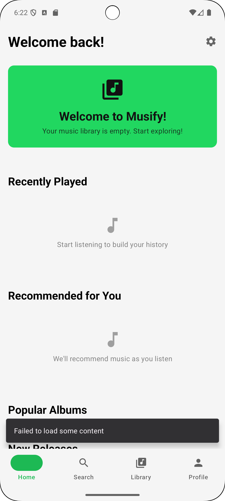
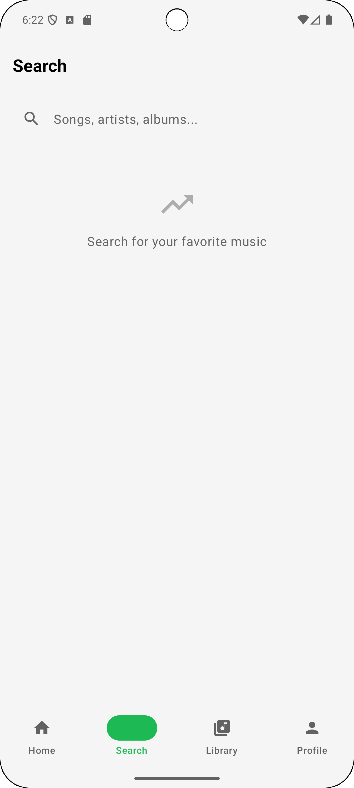
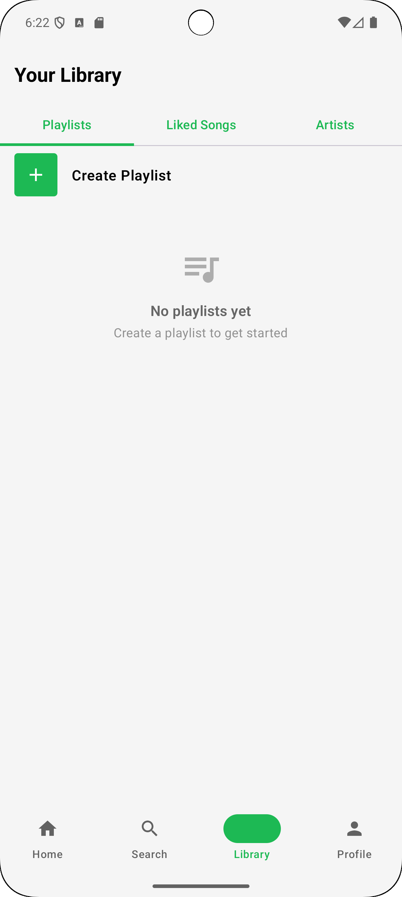
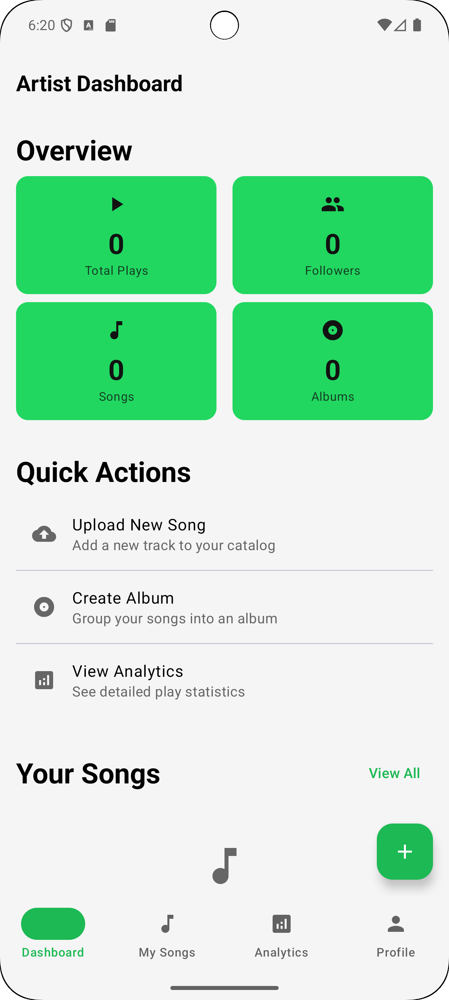
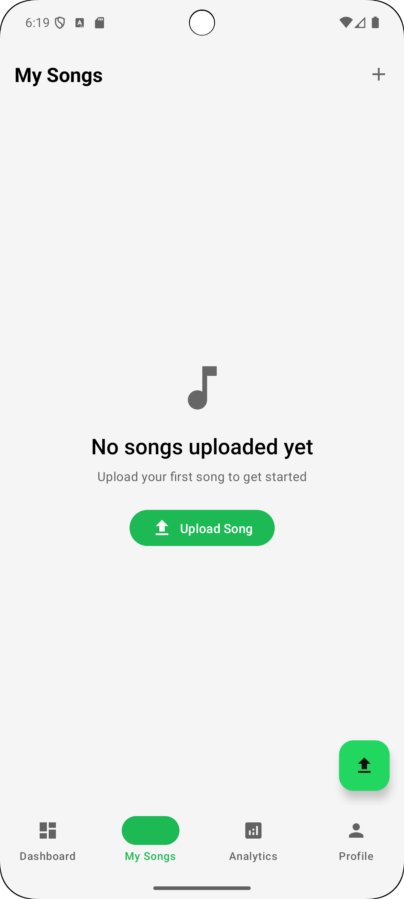
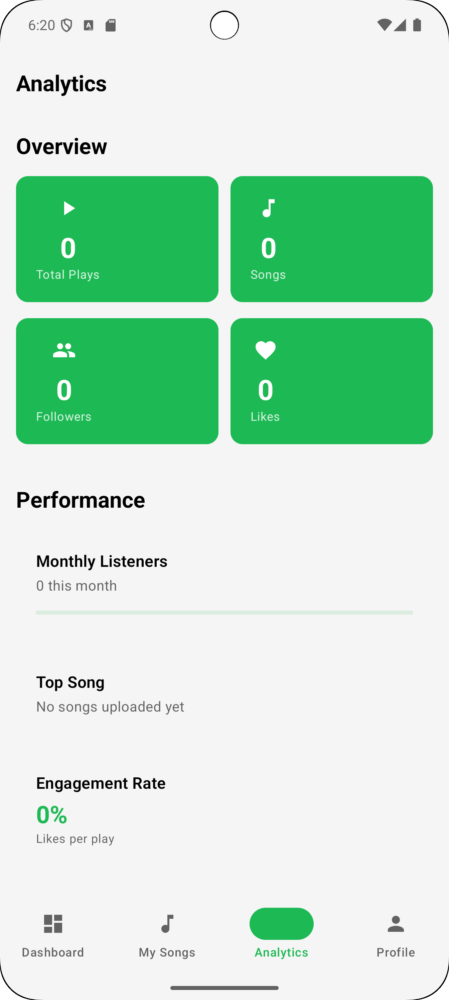
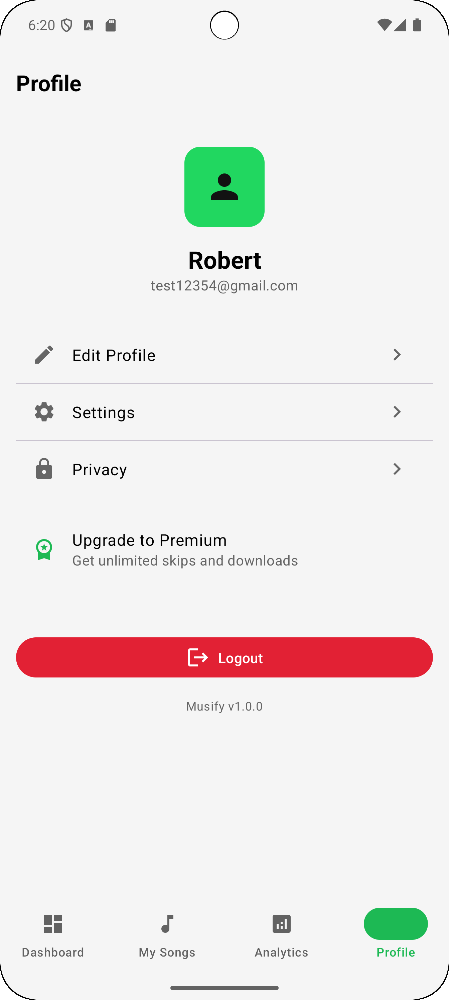

# Musify

A full-stack music streaming platform I built with Kotlin on both sides — a Ktor REST API serving an Android app built with Jetpack Compose.

## Screenshots

### User
<p>
  
  
  
  
</p>

### Artist
<p>
  
  
  
  
</p>

## Backend

Built with **Ktor** and structured around clean architecture — controllers handle HTTP, use cases hold business logic, repositories talk to the database through **Exposed ORM**.

The API handles user auth with **JWT** (access + refresh tokens), supports **OAuth2 with PKCE** and **TOTP-based 2FA**. Passwords are hashed with BCrypt.

Music files are stored on **AWS S3** (with a local filesystem fallback for development) and transcoded using **FFmpeg** for adaptive streaming. The API supports range requests for efficient playback.

**PostgreSQL** handles persistence with schema managed through **Flyway** migrations. **Redis** is used for caching with an in-memory fallback. Connection pooling runs through **HikariCP**.

Payments and subscriptions go through **Stripe** — webhooks handle the lifecycle.

Search uses fuzzy matching with autocomplete and a basic recommendation engine generates daily mixes and song radio.

The whole thing runs in **Docker** behind **Nginx** (rate limiting, SSL, security headers). **GitHub Actions** runs tests and builds the image on every push.

## Android App

Built with **Jetpack Compose** and **Material3**, following MVVM with clean architecture layers — UI talks to ViewModels, ViewModels call use cases, use cases go through repository interfaces.

Music playback uses **Media3/ExoPlayer** with background playback support and queue management. Networking goes through **Retrofit + OkHttp** with token refresh interceptors. Local data is stored with **Room** and credentials use **Encrypted SharedPreferences**.

**Hilt** handles dependency injection. Images load through **Coil**.

## Running locally

```bash
# Backend
cd backend
cp .env.example .env       # configure DB, Redis, S3, Stripe keys
docker-compose up -d       # PostgreSQL + Redis
./gradlew run              # http://localhost:8080

# Frontend — open frontend/ in Android Studio, run on emulator
```

## License

MIT
